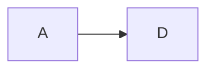

模板编译：

`Vue`中的<template></template>代码这是`Vue`中规定的语法，浏览器是不识别的，`Vue`中自己的模板编译器会将它编译成浏览器识别的`HTML`标签。都是将之先解析为`render`函数，再生成对应的`vNode`，在经过patch的过程，生成最终要渲染的`vNode`，最后生成真实的`DOM`节点。

将<template></template>中的字符串解析成为最终有效的信息就需要借助`AST(AbstractSyntaxTree):抽象语法树`

