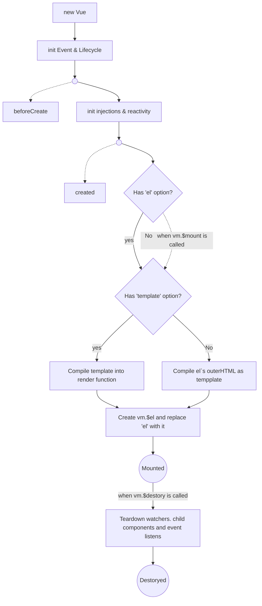

```mermaid
graph TD
  a[new Vue] --> b[init Event & Lifecycle]
  b --> x(( ))
  x -.-> y[beforeCreate]
  x --> c[init injections & reactivity]
  c --> z(( ))
  z -.-> o[created]
  z --> d{Has 'el' option?}
  d -->|yes| e{Has 'template' option?}
  d -.-> |No   when vm.$mount is called|e
  e --> |yes|f[Compile template into render function]
  e --> |No|g[Compile el`s outerHTML as tempplate]
  f --> h[Create vm.$el and replace 'el' with it]
  g --> h
  h --> i((Mounted))
  i -->|when vm.$destory is called|j[Teardown watchers. child components and event listens]
  j --> k((Destoryed))
```

