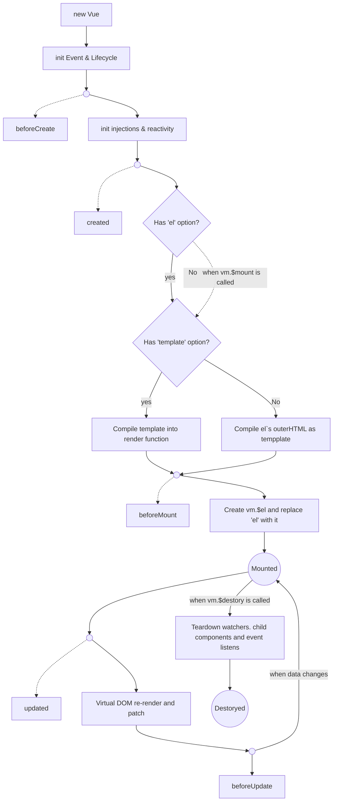

生命周期：

1. 初始化阶段：为`vue`实例上初始化一些属性，事件以及响应式数据
2. 模板编译阶段：将模板编译成渲染函数
3. 挂载阶段：将实例挂载到指定`DOM`上，即模板渲染到真实的`DOM`中
4. 销毁阶段：将实例自身从父组件中删除，并取消依赖追踪及事件监听


使用`vue`：

```javascript
var app = new Vue({
  el: '#app',
  data: {
    message: 'Hello Vue!'
  }
})

其实在自己写的代码运行之前，就会执行vue本身的一些js代码，这个思想其实之前一直没有转变过来，总是以为一开始执行的就是自己写的代码，这样是不对的，vue本身就是一个框架，所以在自己的代码之前就已经做了很多事情，为了能够使用的可以编写更加舒适的代码
所以在之前就已经执行了：
initMixin(Vue)
stateMixin(Vue)
eventsMixin(Vue)
lifecycleMixin(Vue)
renderMixin(Vue)
...
等js代码

function Vue(options) {
  this._init(options)
}
这个_init就是在initMixin的时候挂载在vue原型的方法
Vue.prototype._init = function (options?: Object) {
  const vm = this
  // 将vm.constructor的options的值混合在vue.optioons上，根据不同的选项有不同的合并策略，钩子函数也会合并，并保存在数组中，这样就都可以执行
    vm.$options = mergeOptions(
        resolveConstructorOptions(vm.constructor),
        options || {},
        vm
    )
    vm._self = vm
    initLifecycle(vm)
    initEvents(vm)
    initRender(vm)
    callHook(vm, 'beforeCreate')
    initInjections(vm) // resolve injections before data/props
    initState(vm)
    initProvide(vm) // resolve provide after data/props
    callHook(vm, 'created')

  // 只有挂载了el元素上才会进入下一步，不然就会停在这里
    if (vm.$options.el) {
      vm.$mount(vm.$options.el)
    }
}
所以当我们new Vue()的时候就开始执行了_init()


```

1. `initLifecycle():`

   主要是一些属性的初始化：主要的是`$parent.  $root`

2. `initEvents():`

   在模版编译的过程中就会将代码中的event事件解析出来，分类在render的时候初始化，都是父组件在模版中使用v-on或@注册的子组件内触发的事件

   那么`initEvents()`到底做了什么：

   ```javascript
   vm._events = Object.create(null)
     // init parent attached events
   // 将父组件向子组件注册的事件注册到子组件的实例中
     const listeners = vm.$options._parentListeners
     if (listeners) {
       // 对于新老events的不同，
       updateComponentListeners(vm, listeners)
     }
   ```

   

3. `initRender():`

4. `initInjectioons():`

   1. `provide 和 inject选项绑定的数据不是响应式的`
   2. 先`inject`再`state`最后`provide`是因为`inject`中的数据可能会被`state`用到，`provide`的数据也可能是`state`中的数据

   ```javascript
   // 将子组件中的inject转化为键值对的形式
   const result = resolveInject(vm.$options.inject, vm)
     if (result) {
       toggleObserving(false)
         // 添加值到实例上但是并不添加依赖，但是如果本身的值是一个可监听的对象，那么其对象的值还是可响应的
       Object.keys(result).forEach(key => {
         defineReactive(vm, key, result[key])
       }
       toggleObserving(true)
     }
   ```

5. `initState():`

   ```javascript
   export function initState (vm: Component) {
       // vue2之后将数据的侦测粒度提高到了组件层面，通过_watchers属性，用来存放这个组件内用到的所有状态的依赖
     vm._watchers = []
     const opts = vm.$options
     // 根据options中有哪些选项就去初始化对应的选项：注意初始化的顺序是有一定的讲究的，date可以访问props，而watch又可以监听data和props
     if (opts.props) initProps(vm, opts.props)
     if (opts.methods) initMethods(vm, opts.methods)
     if (opts.data) {
       initData(vm)
     } else {
       observe(vm._data = {}, true /* asRootData */)
     }
     if (opts.computed) initComputed(vm, opts.computed)
     if (opts.watch && opts.watch !== nativeWatch) {
       initWatch(vm, opts.watch)
     }
   }
   ```

6. `initProvide():`

模板编译阶段：

vue其实是包含两个版本的

1. 完整版本
2. 只包含运行时版本

开发时候使用的都是完整版本，部署的时候使用的是只包含运行时的版本，因为部署时候我们使用打包工具将template已经编译成render函数了，可以直接初始化完直接进入挂载阶段

不然就将用户写的template模板编译成render函数。


挂载阶段：

```javascript
Vue.prototype.$mount = function (el,hydrating) {
  el = el && inBrowser ? query(el) : undefined;
  return mountComponent(this, el, hydrating)
};

export function mountComponent (vm,el,hydrating) {
    vm.$el = el
    if (!vm.$options.render) {
        vm.$options.render = createEmptyVNode
    }
    callHook(vm, 'beforeMount')
	// 对比新旧vNode，并将最新的vNode渲染到视图中
    let updateComponent

    updateComponent = () => {
        vm._update(vm._render(), hydrating)
    }
    // 执行updateComponent() 触发依赖收集
    new Watcher(vm, updateComponent, noop, {
        before () {
            if (vm._isMounted) {
                callHook(vm, 'beforeUpdate')
            }
        }
    }, true /* isRenderWatcher */)
    hydrating = false

    if (vm.$vnode == null) {
        vm._isMounted = true
        callHook(vm, 'mounted')
    }
    return vm
}
```

销毁阶段：

```javascript
Vue.prototype.$destroy = function () {
  const vm: Component = this
  if (vm._isBeingDestroyed) {
    return
  }
  callHook(vm, 'beforeDestroy')
  vm._isBeingDestroyed = true
  // remove self from parent
  const parent = vm.$parent
  if (parent && !parent._isBeingDestroyed && !vm.$options.abstract) {
    remove(parent.$children, vm)
  }
  // teardown watchers
  if (vm._watcher) {
    vm._watcher.teardown()
  }
  let i = vm._watchers.length
  while (i--) {
    vm._watchers[i].teardown()
  }
  // remove reference from data ob
  // frozen object may not have observer.
  if (vm._data.__ob__) {
    vm._data.__ob__.vmCount--
  }
  // call the last hook...
  vm._isDestroyed = true
  // invoke destroy hooks on current rendered tree
  vm.__patch__(vm._vnode, null)
  // fire destroyed hook
  callHook(vm, 'destroyed')
  // turn off all instance listeners.
  vm.$off()
  // remove __vue__ reference
  if (vm.$el) {
    vm.$el.__vue__ = null
  }
  // release circular reference (##6759)
  if (vm.$vnode) {
    vm.$vnode.parent = null
  }
}
```


