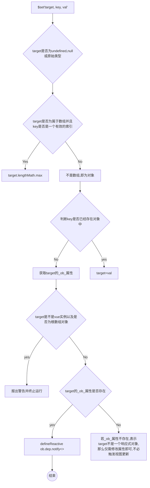

set：

`示例：`

```javascript
vm.$set(target, propertyName/index, value)
```

`params:`

- `{Object | Array} target`
- `{string | number} propertyName/index`
- `{any} value`


`return:` 设置的值


`usage:`向响应式对象中添加一个属性，并确保这个新属性同样是响应式的，且触发视图更新，注意对象不能是`vue`实例，或者`vue`实例的根数据对象

```javascript
export function set (target, key, val){
    if (process.env.NODE_ENV !== 'production' &&
        (isUndef(target) || isPrimitive(target))
       ) {
        warn(`Cannot set reactive property on undefined, null, or primitive value: ${(target: any)}`)
    }
    if (Array.isArray(target) && isValidArrayIndex(key)) {
        target.length = Math.max(target.length, key)
        target.splice(key, 1, val)
        return val
    }
    if (key in target && !(key in Object.prototype)) {
        target[key] = val
        return val
    }
    const ob = (target: any).__ob__
    if (target._isVue || (ob && ob.vmCount)) {
        process.env.NODE_ENV !== 'production' && warn(
            'Avoid adding reactive properties to a Vue instance or its root $data ' +
            'at runtime - declare it upfront in the data option.'
        )
        return val
    }
    if (!ob) {
        target[key] = val
        return val
    }
    defineReactive(ob.value, key, val)
    ob.dep.notify()
    return val
}
```




